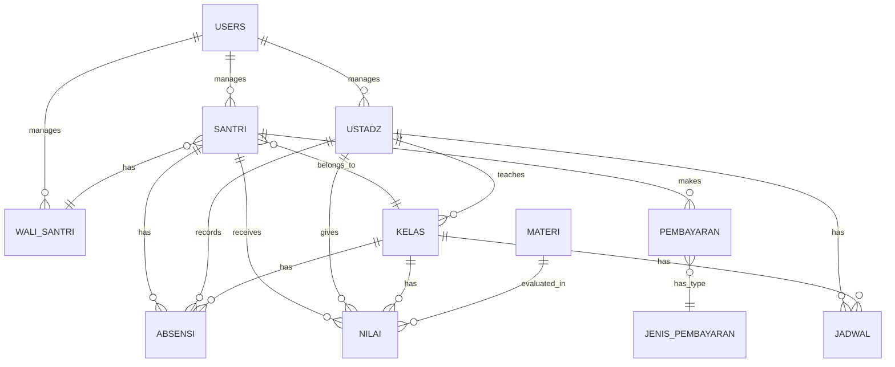

# Database Design - TPQ Baitus Shuffah Management System

## 📊 Entity Relationship Diagram (ERD)



## 🗃️ Struktur Tabel

### 1. USERS (Pengguna Sistem)
```sql
CREATE TABLE users (
    id BIGINT PRIMARY KEY AUTO_INCREMENT,
    username VARCHAR(50) UNIQUE NOT NULL,
    email VARCHAR(100) UNIQUE NOT NULL,
    password VARCHAR(255) NOT NULL,
    role ENUM('admin', 'ustadz', 'wali_santri', 'santri') NOT NULL,
    is_active BOOLEAN DEFAULT TRUE,
    last_login TIMESTAMP NULL,
    created_at TIMESTAMP DEFAULT CURRENT_TIMESTAMP,
    updated_at TIMESTAMP DEFAULT CURRENT_TIMESTAMP ON UPDATE CURRENT_TIMESTAMP
);
```

### 2. SANTRI (Data Santri)
```sql
CREATE TABLE santri (
    id BIGINT PRIMARY KEY AUTO_INCREMENT,
    user_id BIGINT,
    nis VARCHAR(20) UNIQUE NOT NULL,
    nama_lengkap VARCHAR(100) NOT NULL,
    nama_panggilan VARCHAR(50),
    jenis_kelamin ENUM('L', 'P') NOT NULL,
    tempat_lahir VARCHAR(50),
    tanggal_lahir DATE,
    alamat TEXT,
    no_hp VARCHAR(15),
    kelas_id BIGINT,
    wali_santri_id BIGINT,
    tanggal_masuk DATE NOT NULL,
    status ENUM('aktif', 'nonaktif', 'lulus', 'pindah') DEFAULT 'aktif',
    foto VARCHAR(255),
    created_at TIMESTAMP DEFAULT CURRENT_TIMESTAMP,
    updated_at TIMESTAMP DEFAULT CURRENT_TIMESTAMP ON UPDATE CURRENT_TIMESTAMP,
    
    FOREIGN KEY (user_id) REFERENCES users(id) ON DELETE SET NULL,
    FOREIGN KEY (kelas_id) REFERENCES kelas(id) ON DELETE SET NULL,
    FOREIGN KEY (wali_santri_id) REFERENCES wali_santri(id) ON DELETE SET NULL
);
```

### 3. WALI_SANTRI (Data Wali Santri)
```sql
CREATE TABLE wali_santri (
    id BIGINT PRIMARY KEY AUTO_INCREMENT,
    user_id BIGINT,
    nama_lengkap VARCHAR(100) NOT NULL,
    hubungan ENUM('ayah', 'ibu', 'kakek', 'nenek', 'paman', 'bibi', 'wali') NOT NULL,
    no_hp VARCHAR(15),
    email VARCHAR(100),
    alamat TEXT,
    pekerjaan VARCHAR(50),
    created_at TIMESTAMP DEFAULT CURRENT_TIMESTAMP,
    updated_at TIMESTAMP DEFAULT CURRENT_TIMESTAMP ON UPDATE CURRENT_TIMESTAMP,
    
    FOREIGN KEY (user_id) REFERENCES users(id) ON DELETE SET NULL
);
```

### 4. USTADZ (Data Pengajar)
```sql
CREATE TABLE ustadz (
    id BIGINT PRIMARY KEY AUTO_INCREMENT,
    user_id BIGINT,
    nip VARCHAR(20) UNIQUE,
    nama_lengkap VARCHAR(100) NOT NULL,
    jenis_kelamin ENUM('L', 'P') NOT NULL,
    tempat_lahir VARCHAR(50),
    tanggal_lahir DATE,
    alamat TEXT,
    no_hp VARCHAR(15),
    email VARCHAR(100),
    pendidikan_terakhir VARCHAR(50),
    spesialisasi TEXT,
    tanggal_bergabung DATE NOT NULL,
    status ENUM('aktif', 'nonaktif', 'cuti') DEFAULT 'aktif',
    foto VARCHAR(255),
    created_at TIMESTAMP DEFAULT CURRENT_TIMESTAMP,
    updated_at TIMESTAMP DEFAULT CURRENT_TIMESTAMP ON UPDATE CURRENT_TIMESTAMP,
    
    FOREIGN KEY (user_id) REFERENCES users(id) ON DELETE SET NULL
);
```

### 5. KELAS (Data Kelas)
```sql
CREATE TABLE kelas (
    id BIGINT PRIMARY KEY AUTO_INCREMENT,
    nama_kelas VARCHAR(50) NOT NULL,
    tingkat ENUM('iqro_1', 'iqro_2', 'iqro_3', 'iqro_4', 'iqro_5', 'iqro_6', 'quran', 'tajwid') NOT NULL,
    ustadz_id BIGINT,
    kapasitas_maksimal INT DEFAULT 15,
    jumlah_santri INT DEFAULT 0,
    ruangan VARCHAR(50),
    deskripsi TEXT,
    status ENUM('aktif', 'nonaktif') DEFAULT 'aktif',
    created_at TIMESTAMP DEFAULT CURRENT_TIMESTAMP,
    updated_at TIMESTAMP DEFAULT CURRENT_TIMESTAMP ON UPDATE CURRENT_TIMESTAMP,
    
    FOREIGN KEY (ustadz_id) REFERENCES ustadz(id) ON DELETE SET NULL
);
```

### 6. JADWAL (Jadwal Pembelajaran)
```sql
CREATE TABLE jadwal (
    id BIGINT PRIMARY KEY AUTO_INCREMENT,
    kelas_id BIGINT NOT NULL,
    ustadz_id BIGINT NOT NULL,
    hari ENUM('senin', 'selasa', 'rabu', 'kamis', 'jumat', 'sabtu', 'minggu') NOT NULL,
    jam_mulai TIME NOT NULL,
    jam_selesai TIME NOT NULL,
    ruangan VARCHAR(50),
    status ENUM('aktif', 'nonaktif') DEFAULT 'aktif',
    created_at TIMESTAMP DEFAULT CURRENT_TIMESTAMP,
    updated_at TIMESTAMP DEFAULT CURRENT_TIMESTAMP ON UPDATE CURRENT_TIMESTAMP,
    
    FOREIGN KEY (kelas_id) REFERENCES kelas(id) ON DELETE CASCADE,
    FOREIGN KEY (ustadz_id) REFERENCES ustadz(id) ON DELETE CASCADE
);
```

### 7. MATERI (Materi Pembelajaran)
```sql
CREATE TABLE materi (
    id BIGINT PRIMARY KEY AUTO_INCREMENT,
    nama_materi VARCHAR(100) NOT NULL,
    tingkat ENUM('iqro_1', 'iqro_2', 'iqro_3', 'iqro_4', 'iqro_5', 'iqro_6', 'quran', 'tajwid') NOT NULL,
    halaman_mulai INT,
    halaman_selesai INT,
    target_hafalan TEXT,
    deskripsi TEXT,
    file_materi VARCHAR(255),
    created_at TIMESTAMP DEFAULT CURRENT_TIMESTAMP,
    updated_at TIMESTAMP DEFAULT CURRENT_TIMESTAMP ON UPDATE CURRENT_TIMESTAMP
);
```

### 8. ABSENSI (Data Kehadiran)
```sql
CREATE TABLE absensi (
    id BIGINT PRIMARY KEY AUTO_INCREMENT,
    santri_id BIGINT NOT NULL,
    kelas_id BIGINT NOT NULL,
    ustadz_id BIGINT NOT NULL,
    tanggal DATE NOT NULL,
    status ENUM('hadir', 'izin', 'sakit', 'alpha') NOT NULL,
    waktu_masuk TIME,
    waktu_keluar TIME,
    keterangan TEXT,
    created_at TIMESTAMP DEFAULT CURRENT_TIMESTAMP,
    updated_at TIMESTAMP DEFAULT CURRENT_TIMESTAMP ON UPDATE CURRENT_TIMESTAMP,
    
    FOREIGN KEY (santri_id) REFERENCES santri(id) ON DELETE CASCADE,
    FOREIGN KEY (kelas_id) REFERENCES kelas(id) ON DELETE CASCADE,
    FOREIGN KEY (ustadz_id) REFERENCES ustadz(id) ON DELETE CASCADE,
    
    UNIQUE KEY unique_absensi (santri_id, tanggal)
);
```

### 9. NILAI (Penilaian Santri)
```sql
CREATE TABLE nilai (
    id BIGINT PRIMARY KEY AUTO_INCREMENT,
    santri_id BIGINT NOT NULL,
    kelas_id BIGINT NOT NULL,
    ustadz_id BIGINT NOT NULL,
    materi_id BIGINT NOT NULL,
    tanggal_penilaian DATE NOT NULL,
    jenis_penilaian ENUM('bacaan', 'hafalan', 'tajwid', 'akhlak', 'tugas') NOT NULL,
    nilai_angka DECIMAL(5,2),
    nilai_huruf ENUM('A', 'B', 'C', 'D', 'E'),
    catatan TEXT,
    created_at TIMESTAMP DEFAULT CURRENT_TIMESTAMP,
    updated_at TIMESTAMP DEFAULT CURRENT_TIMESTAMP ON UPDATE CURRENT_TIMESTAMP,
    
    FOREIGN KEY (santri_id) REFERENCES santri(id) ON DELETE CASCADE,
    FOREIGN KEY (kelas_id) REFERENCES kelas(id) ON DELETE CASCADE,
    FOREIGN KEY (ustadz_id) REFERENCES ustadz(id) ON DELETE CASCADE,
    FOREIGN KEY (materi_id) REFERENCES materi(id) ON DELETE CASCADE
);
```

### 10. JENIS_PEMBAYARAN (Jenis Pembayaran)
```sql
CREATE TABLE jenis_pembayaran (
    id BIGINT PRIMARY KEY AUTO_INCREMENT,
    nama_pembayaran VARCHAR(100) NOT NULL,
    nominal DECIMAL(10,2) NOT NULL,
    periode ENUM('bulanan', 'semesteran', 'tahunan', 'sekali') NOT NULL,
    deskripsi TEXT,
    status ENUM('aktif', 'nonaktif') DEFAULT 'aktif',
    created_at TIMESTAMP DEFAULT CURRENT_TIMESTAMP,
    updated_at TIMESTAMP DEFAULT CURRENT_TIMESTAMP ON UPDATE CURRENT_TIMESTAMP
);
```

### 11. PEMBAYARAN (Transaksi Pembayaran)
```sql
CREATE TABLE pembayaran (
    id BIGINT PRIMARY KEY AUTO_INCREMENT,
    santri_id BIGINT NOT NULL,
    jenis_pembayaran_id BIGINT NOT NULL,
    tanggal_pembayaran DATE NOT NULL,
    periode_pembayaran VARCHAR(20), -- contoh: "2025-01" untuk Januari 2025
    nominal DECIMAL(10,2) NOT NULL,
    metode_pembayaran ENUM('tunai', 'transfer', 'qris', 'kartu') NOT NULL,
    bukti_pembayaran VARCHAR(255),
    status ENUM('pending', 'lunas', 'terlambat') DEFAULT 'pending',
    keterangan TEXT,
    created_by BIGINT,
    created_at TIMESTAMP DEFAULT CURRENT_TIMESTAMP,
    updated_at TIMESTAMP DEFAULT CURRENT_TIMESTAMP ON UPDATE CURRENT_TIMESTAMP,
    
    FOREIGN KEY (santri_id) REFERENCES santri(id) ON DELETE CASCADE,
    FOREIGN KEY (jenis_pembayaran_id) REFERENCES jenis_pembayaran(id) ON DELETE CASCADE,
    FOREIGN KEY (created_by) REFERENCES users(id) ON DELETE SET NULL
);
```

## 🔍 Indexes untuk Performance

```sql
-- Indexes untuk query yang sering digunakan
CREATE INDEX idx_santri_kelas ON santri(kelas_id);
CREATE INDEX idx_santri_wali ON santri(wali_santri_id);
CREATE INDEX idx_absensi_tanggal ON absensi(tanggal);
CREATE INDEX idx_absensi_santri_tanggal ON absensi(santri_id, tanggal);
CREATE INDEX idx_nilai_santri ON nilai(santri_id);
CREATE INDEX idx_pembayaran_santri ON pembayaran(santri_id);
CREATE INDEX idx_pembayaran_periode ON pembayaran(periode_pembayaran);
CREATE INDEX idx_jadwal_hari ON jadwal(hari);
```

## 🔐 Views untuk Reporting

```sql
-- View untuk laporan santri per kelas
CREATE VIEW v_santri_per_kelas AS
SELECT 
    k.nama_kelas,
    k.tingkat,
    u.nama_lengkap as nama_ustadz,
    COUNT(s.id) as jumlah_santri,
    k.kapasitas_maksimal
FROM kelas k
LEFT JOIN santri s ON k.id = s.kelas_id AND s.status = 'aktif'
LEFT JOIN ustadz u ON k.ustadz_id = u.id
GROUP BY k.id;

-- View untuk laporan pembayaran bulanan
CREATE VIEW v_pembayaran_bulanan AS
SELECT 
    s.nama_lengkap as nama_santri,
    s.nis,
    k.nama_kelas,
    jp.nama_pembayaran,
    p.periode_pembayaran,
    p.nominal,
    p.status,
    p.tanggal_pembayaran
FROM pembayaran p
JOIN santri s ON p.santri_id = s.id
JOIN kelas k ON s.kelas_id = k.id
JOIN jenis_pembayaran jp ON p.jenis_pembayaran_id = jp.id;
```

## 📊 Sample Data Seeds

```sql
-- Insert sample data untuk testing
INSERT INTO jenis_pembayaran (nama_pembayaran, nominal, periode) VALUES
('SPP Bulanan', 50000.00, 'bulanan'),
('Uang Pendaftaran', 100000.00, 'sekali'),
('Seragam TPQ', 75000.00, 'sekali');

INSERT INTO materi (nama_materi, tingkat, halaman_mulai, halaman_selesai) VALUES
('Pengenalan Huruf Hijaiyah', 'iqro_1', 1, 10),
('Bacaan Panjang Pendek', 'iqro_2', 1, 15),
('Tajwid Dasar', 'iqro_3', 1, 20);
```

---

**Note**: Database design ini akan terus dikembangkan seiring dengan kebutuhan fitur yang bertambah.
